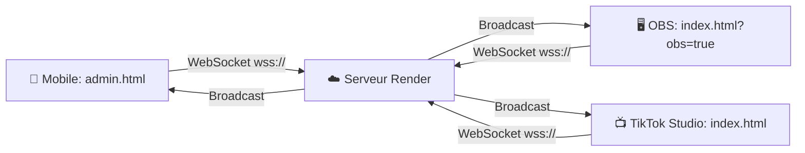

# 🚀 Accès à votre Application sur Render

## ✅ L'application est en ligne !

Votre application TikTok Auction Board est **déployée avec succès** sur Render.

---

## 📱 URLs d'Accès

### Interface Admin (Mobile)
👉 **https://tiktok-auction-board.onrender.com/admin.html**

Utilisez cette URL pour :
- ⏱️ Contrôler le timer
- 🎥 Se connecter à TikTok Live
- 🎛️ Gérer le classement

**⚠️ Important :** Ajoutez toujours `.html` à la fin de l'URL !

---

### Overlay Principal (OBS / TikTok Live Studio)
👉 **https://tiktok-auction-board.onrender.com/index.html**

Utilisez cette URL dans :
- OBS Browser Source
- TikTok Live Studio
- Navigateur pour prévisualisation

**Pour OBS (sans panneau de contrôle) :**
👉 **https://tiktok-auction-board.onrender.com/index.html?obs=true**

---

## 🔧 WebSocket Automatique

✅ Les WebSockets fonctionnent automatiquement sur Render avec `wss://`
✅ La synchronisation temps réel est active
✅ Tous les clients se connectent au même serveur

---

## 📲 Utilisation Typique

### 1️⃣ Sur votre téléphone (contrôle)
```
https://tiktok-auction-board.onrender.com/admin.html
```

### 2️⃣ Dans OBS (overlay)
```
https://tiktok-auction-board.onrender.com/index.html?obs=true
```

### 3️⃣ Dans TikTok Live Studio
```
https://tiktok-auction-board.onrender.com/index.html
```

---

## ⚠️ Erreurs Courantes

❌ **Ne fonctionne PAS :**
- `https://tiktok-auction-board.onrender.com/admin`
- `https://tiktok-auction-board.onrender.com/`

✅ **Fonctionne :**
- `https://tiktok-auction-board.onrender.com/admin.html`
- `https://tiktok-auction-board.onrender.com/index.html`

**Explication :** Le serveur Node.js sert des fichiers statiques, il faut donc spécifier le nom complet du fichier avec l'extension `.html`.

---

## 🎯 Workflow Complet



**Tous les clients sont synchronisés en temps réel !**

---

## 📋 Checklist de Test

- [ ] Ouvrir admin.html sur mobile → ✅ Connecté
- [ ] Ouvrir index.html dans OBS → ✅ Connecté
- [ ] Changer le timer dans admin → ✅ Visible sur OBS
- [ ] Démarrer le timer → ✅ Synchronisé partout

---

## 🔗 Liens Rapides (Copier-Coller)

**Admin Mobile :**
```
https://tiktok-auction-board.onrender.com/admin.html
```

**Overlay OBS :**
```
https://tiktok-auction-board.onrender.com/index.html?obs=true
```

**Overlay TikTok Studio :**
```
https://tiktok-auction-board.onrender.com/index.html
```

---

## 💡 Astuce Mobile

Pour un accès rapide depuis votre téléphone :

1. Ouvrez l'URL admin dans votre navigateur mobile
2. Appuyez sur "Ajouter à l'écran d'accueil" (Safari/Chrome)
3. Vous aurez une icône d'application sur votre écran d'accueil ! 📱

---

Votre application est **prête à l'emploi** ! 🎉
